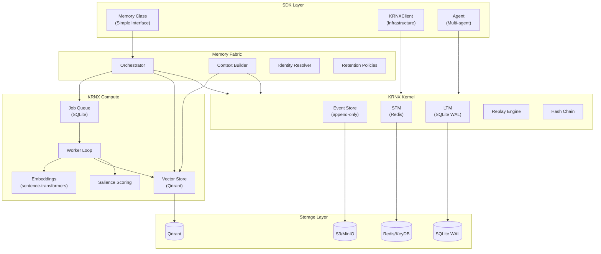
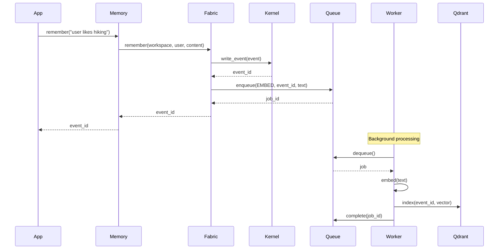
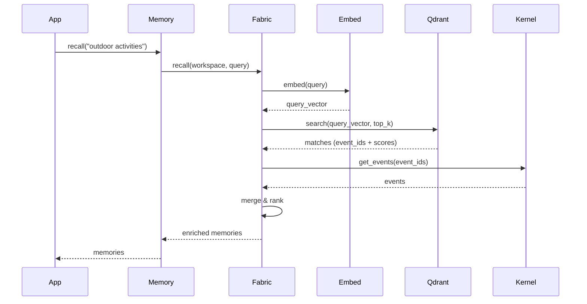
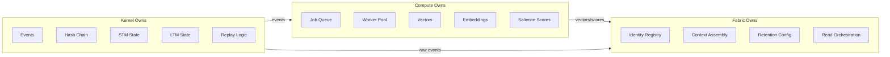
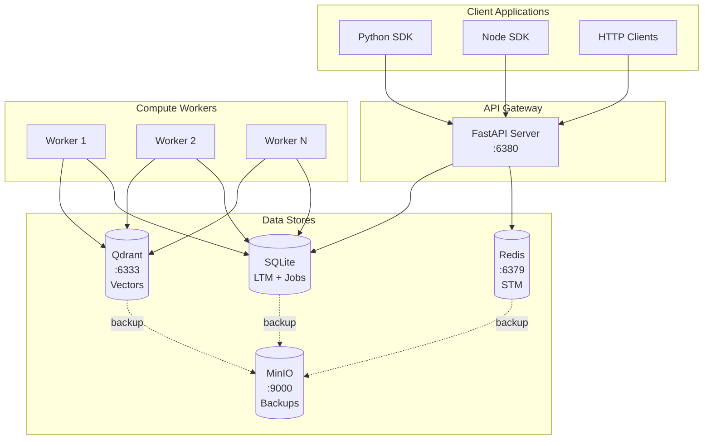
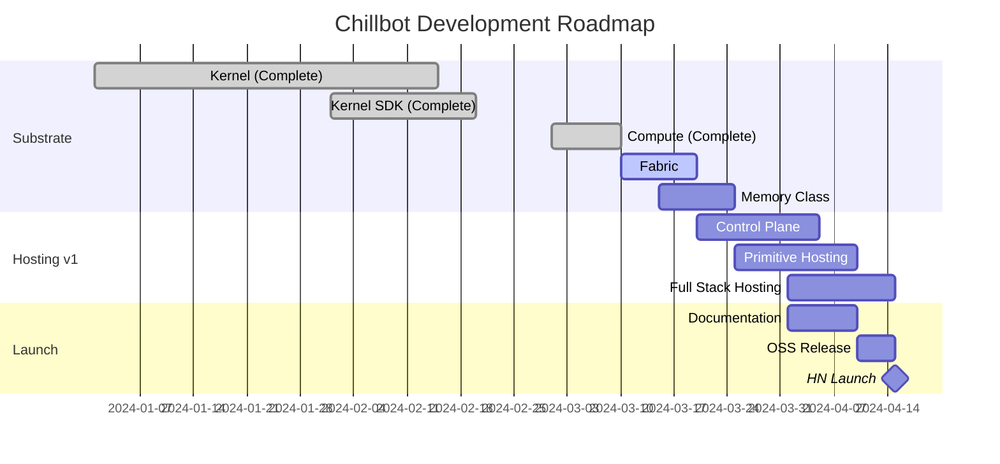

# Chillbot Architecture Diagrams

## System Architecture



## Data Flow: Remember



## Data Flow: Recall



## Component Ownership



## File Structure

```
chillbot/
├── __init__.py                 # Memory, Agent exports
├── memory.py                   # Simple interface ← YOU ARE HERE NEXT
│
├── kernel/                     # YOUR EXISTING KRNX CODE
│   ├── __init__.py             
│   ├── client.py               # ← krnx_sdk/client.py
│   ├── agent.py                # ← krnx_sdk/agent.py
│   ├── exceptions.py           # ← krnx_sdk/exceptions.py
│   ├── controller.py           # ← krnx/controller.py
│   ├── stm.py                  # ← krnx/stm.py
│   ├── ltm.py                  # ← krnx/ltm.py
│   └── models.py               # ← krnx/models.py
│
├── compute/                    # ✅ COMPLETE
│   ├── __init__.py             
│   ├── queue.py                # SQLite job queue
│   ├── embeddings.py           # sentence-transformers
│   ├── vectors.py              # Qdrant interface
│   ├── salience.py             # Importance scoring
│   └── worker.py               # Background processor
│
├── fabric/                     # 🔄 NEXT TO BUILD
│   ├── __init__.py             
│   ├── orchestrator.py         # Main MemoryFabric class
│   ├── context.py              # Context builder
│   ├── identity.py             # Agent/scope resolution
│   └── retention.py            # Retention policy triggers
│
└── server/                     # API SERVER
    ├── __init__.py             
    ├── api.py                  # ← krnx/api_server.py
    └── config.py               
```

## Deployment Topology



## Hosting Phases


